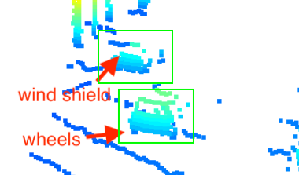

# SDCND : Sensor Fusion and Tracking

Write a short recap of the four tracking steps and what you implemented there (EKF, track management, data association, camera-lidar sensor fusion). Which results did you achieve? Which part of the project was most difficult for you to complete, and why?:

Do you see any benefits in camera-lidar fusion compared to lidar-only tracking (in theory and in your concrete results)?:

Which challenges will a sensor fusion system face in real-life scenarios? Did you see any of these challenges in the project?
Can you think of ways to improve your tracking results in the future?:
* In rela-Life a big challenge ist to compute in real-Time.

## Step 1

  

## Step 2

  

## Step 3

  

## Step 4

  

  

# Midterm Project
This Section belongs to the Midterm project
## Visualize range image channels (ID_S1_EX1)
The Following Tasks were done:
	
* Convert range image “range” channel to 8bit
* Convert range image “intensity” channel to 8bit
* Crop range image to +/- 90 deg. left and right of the forward-facing x-axis
* Stack cropped range and intensity image vertically and visualize the result using OpenCV

  

## Visualize point-cloud (ID_S1_EX2)
As part of this exercise, cars in the Piontcloud are identified to analyse which features are stable. If we have a look at the Pictures below we can identify the following features to be stable:
* Windows
* Overall shape of the Vehicle (e. g. roof- and hoodline)
* Tires

  
  
  
   
  
  
  
   
  
   

