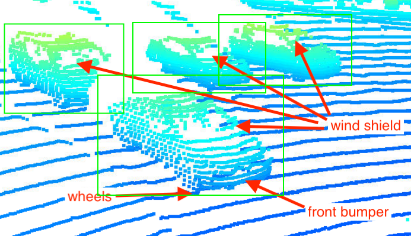

# Visualize point-cloud (ID_S1_EX2)
As part of this exercise, cars in the Piontcloud are identified to analyse which features are stable. If we have a look at the Pictures below we can identify the following features to be stable:
* Windows
* Overall shape of the Vehicle (e. g. roof- and hoodline)
* Tires

  
  
  
   
  
  
  
   
  
   

